<div align="center">

# 🌌 Nebula — Smart URL Shortener

### Transform long URLs into powerful short links

[](https://nodejs.org/)
[](https://react.dev/)
[](https://www.mongodb.com/atlas)
[](https://expressjs.com/)
[](https://vitejs.dev/)
[](https://tailwindcss.com/)

**Nebula** is a modern, full-stack URL shortening platform with rich analytics, QR code generation, Google OAuth, and a stunning glassmorphism UI. Built with the MERN stack, it empowers users to shorten, track, and manage their links from a single premium dashboard.

[Features](#-features) · [Tech Stack](#-tech-stack) · [Architecture](#-architecture-diagram) · [Setup](#-setup-instructions) · [API Reference](#-api-reference) · [Screenshots](#-key-pages)

</div>

---

## 🎬 Project Demo

<div align="center">

<a href="https://www.loom.com/share/03cd6db43dad47dda13d6344a6645d99">
  
</a>

**👆 Click to watch the full project walkthrough on Loom**

> 🎥 *A complete demo showcasing URL shortening, analytics dashboard, QR code generation, Google OAuth, theme switching, and the responsive glassmorphism UI in action.*

</div>

---

## 📖 About the Project

Nebula is not just another URL shortener — it's a **complete link management platform**. Whether you're a marketer tracking campaign performance, a developer sharing quick links, or a business monitoring click analytics, Nebula provides the tools you need with a beautiful, intuitive interface.

### What can you do with Nebula?

- **Shorten URLs** — Convert any long URL into a clean, shareable short link
- **Custom Aliases** — Choose your own memorable short codes (e.g., `nebula.app/my-brand`)
- **QR Code Generation** — Instantly generate downloadable QR codes for every shortened link
- **Click Analytics** — Track total clicks, browser usage, device types, and geographic data
- **Link Management** — Edit, enable/disable, set expiry dates, or bulk-delete your links
- **Public Stats Pages** — Share a beautiful, read-only analytics page for any link
- **Account Settings** — Manage profile, change password, toggle theme preferences

---

## ✨ Features

| Category | Feature | Description |
|----------|---------|-------------|
| 🔗 **URL Management** | Shorten URLs | Generate 6-character unique short codes |
| | Custom Aliases | User-defined short codes with validation |
| | Link Expiration | Set optional expiry dates on links |
| | Enable/Disable Links | Toggle link active status without deletion |
| | Bulk Delete | Select and remove multiple links at once |
| | Edit Links | Modify original URL, alias, or expiry |
| 📊 **Analytics** | Click Tracking | Real-time click count per link |
| | Browser Analytics | Breakdown by Chrome, Firefox, Safari, etc. |
| | Device Analytics | Desktop vs. Mobile vs. Tablet distribution |
| | Geographic Data | Country-level visitor tracking |
| | Public Stats Page | Shareable analytics view for any link |
| | Interactive Charts | Visual analytics with dynamic date ranges |
| 🔐 **Authentication** | Email/Password | Secure signup & login with bcrypt hashing |
| | Google OAuth | One-click sign-in with Google accounts |
| | JWT Tokens | Stateless auth via HTTP-only cookies |
| | Forgot Password | Token-based password reset flow |
| | Profile Management | Update name, avatar, and password |
| 🎨 **UI/UX** | Glassmorphism Design | Premium frosted-glass aesthetic |
| | Dark/Light Theme | System-aware theme with manual toggle |
| | Responsive Layout | Mobile-first design across all viewports |
| | Micro-animations | Framer Motion & GSAP powered transitions |
| | Offline Detection | Graceful overlay when connectivity is lost |
| | QR Code Download | Generate & save QR codes as images |

---

## 🛠 Tech Stack

### Frontend

| Technology | Purpose |
|-----------|---------|
| **React 19** | UI component library with hooks |
| **Vite 8** | Lightning-fast dev server & bundler |
| **TailwindCSS 4** | Utility-first styling framework |
| **React Router 7** | Client-side routing & navigation |
| **Framer Motion** | Declarative animations & page transitions |
| **GSAP** | High-performance timeline animations |
| **Lucide React** | Beautiful, consistent icon library |
| **QRCode** | Client-side QR code generation |
| **React Hot Toast** | Elegant notification system |
| **@react-oauth/google** | Google OAuth integration |

### Backend

| Technology | Purpose |
|-----------|---------|
| **Node.js 22+** | JavaScript runtime environment |
| **Express 5** | Minimal & flexible web framework |
| **MongoDB + Mongoose 9** | NoSQL database with ODM |
| **JSON Web Tokens** | Stateless authentication |
| **bcryptjs** | Secure password hashing (salt rounds: 12) |
| **express-validator** | Input validation & sanitization |
| **cookie-parser** | HTTP-only cookie management |
| **Nodemailer** | Email dispatch (password resets) |
| **dotenv** | Environment variable management |
| **Nodemon** | Development hot-reload |

---

## 🏗 Architecture Diagram

### High-Level System Architecture

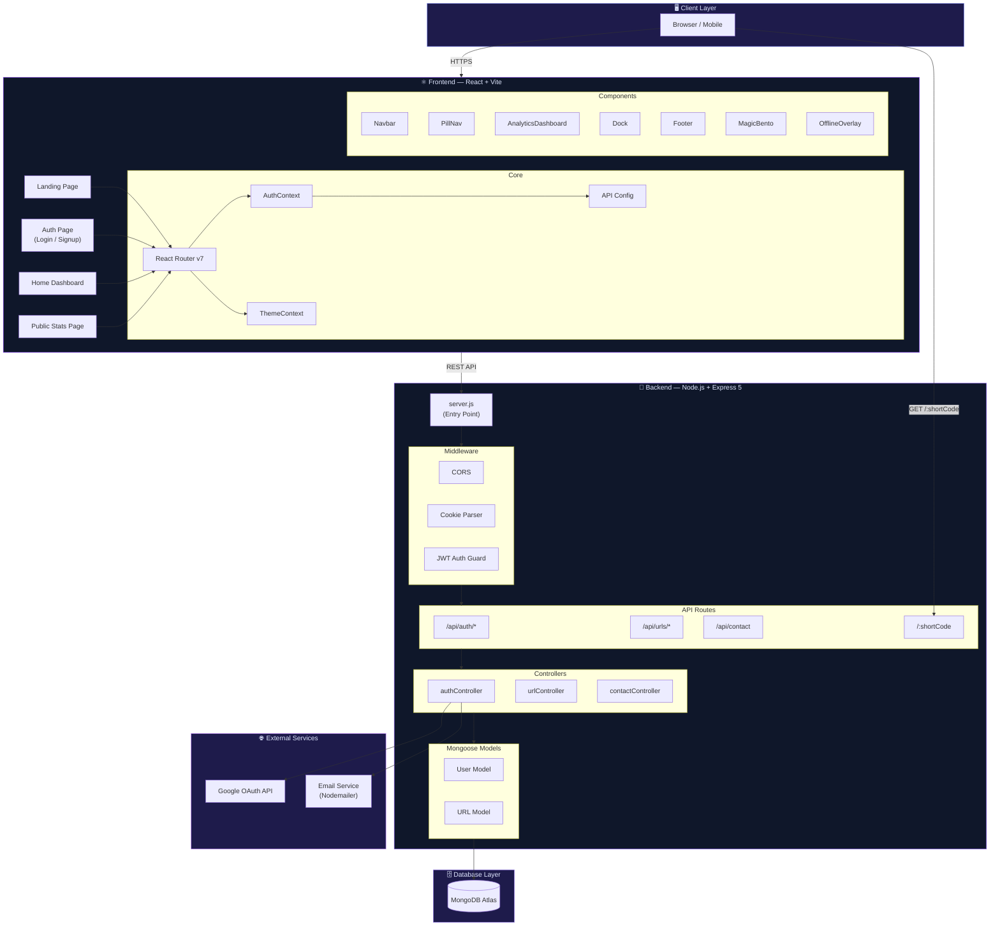

### Request-Response Workflow

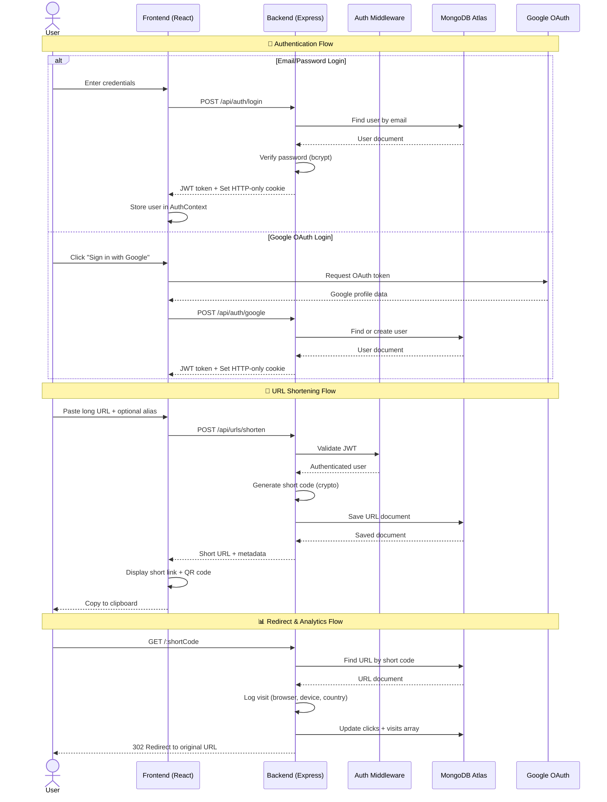

### Data Model Schema

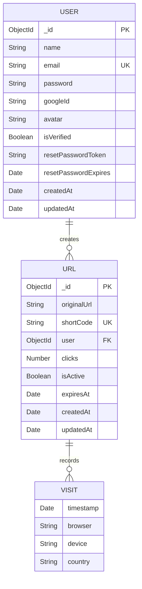

### Frontend Component Tree

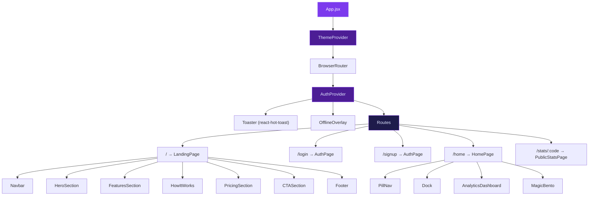

---

## 📂 Project Structure

```
HTN-PROJ/
├── Backend/
│   ├── config/
│   │   └── db.js                 # MongoDB Atlas connection
│   ├── Controller/
│   │   ├── authController.js     # Auth logic (signup, login, OAuth, reset)
│   │   ├── urlController.js      # URL CRUD + redirect + analytics
│   │   └── contactController.js  # Contact form handler
│   ├── middleware/
│   │   └── auth.js               # JWT generation & route protection
│   ├── Models/
│   │   ├── User.js               # User schema with password hashing
│   │   └── Url.js                # URL schema with visit tracking
│   ├── Routes/
│   │   ├── authRoutes.js         # Auth endpoints with validation
│   │   ├── urlRoutes.js          # URL management endpoints
│   │   └── contactRoutes.js      # Contact form endpoint
│   ├── server.js                 # Express app entry point
│   ├── package.json
│   └── .env                      # Environment variables (not committed)
│
├── Frontend/
│   ├── public/                   # Static assets
│   ├── src/
│   │   ├── assets/               # Images (logo, hero, icons)
│   │   ├── Components/
│   │   │   ├── landing/          # Landing page sections
│   │   │   │   ├── HeroSection.jsx
│   │   │   │   ├── FeaturesSection.jsx
│   │   │   │   ├── HowItWorks.jsx
│   │   │   │   ├── PricingSection.jsx
│   │   │   │   └── CTASection.jsx
│   │   │   ├── AnalyticsDashboard.jsx
│   │   │   ├── Dock.jsx
│   │   │   ├── Footer.jsx
│   │   │   ├── MagicBento.jsx
│   │   │   ├── Navbar.jsx
│   │   │   ├── OfflineOverlay.jsx
│   │   │   ├── PillNav.jsx
│   │   │   └── SpotlightCard.jsx
│   │   ├── context/
│   │   │   ├── AuthContext.jsx   # Global auth state management
│   │   │   └── ThemeContext.jsx  # Dark/Light theme provider
│   │   ├── pages/
│   │   │   ├── LandingPage.jsx   # Marketing landing page
│   │   │   ├── AuthPage.jsx      # Unified login/signup page
│   │   │   ├── HomePage.jsx      # Main dashboard (URL mgmt + analytics)
│   │   │   ├── PublicStatsPage.jsx # Public analytics view
│   │   │   ├── Login.jsx         # Login component
│   │   │   └── Signup.jsx        # Signup component
│   │   ├── App.jsx               # Root component with routing
│   │   ├── config.js             # API base URL configuration
│   │   ├── index.css             # Global styles & design tokens
│   │   └── main.jsx              # React entry point
│   ├── index.html                # HTML template with SEO meta
│   ├── vite.config.js            # Vite configuration
│   └── package.json
│
└── README.md                     # ← You are here
```

---

## 🚀 Setup Instructions

### Prerequisites

Ensure you have the following installed:

| Tool | Version | Download |
|------|---------|----------|
| **Node.js** | v22 or higher | [nodejs.org](https://nodejs.org/) |
| **npm** | v10+ (bundled with Node) | — |
| **MongoDB Atlas** | Cloud account (free tier works) | [mongodb.com/atlas](https://www.mongodb.com/atlas) |
| **Git** | Latest | [git-scm.com](https://git-scm.com/) |

### 1. Clone the Repository

```bash
git clone https://github.com/Rithik186/url-shortener-proj.git
cd url-shortener-proj
```

### 2. Backend Setup

```bash
# Navigate to backend directory
cd Backend

# Install dependencies
npm install
```

Create a `.env` file in the `Backend/` directory:

```env
# Server
PORT=5000
NODE_ENV=development

# MongoDB Atlas connection string
MONGO_URI=mongodb+srv://<username>:<password>@<cluster>.mongodb.net/<database>?retryWrites=true&w=majority

# JWT Configuration
JWT_SECRET=your_super_secret_jwt_key_here
JWT_EXPIRES_IN=7d

# Frontend URL (for CORS)
FRONTEND_URL=http://localhost:5173
CLIENT_URL=http://localhost:5173

# Google OAuth (optional — for Google sign-in)
GOOGLE_CLIENT_ID=your_google_client_id

# Email (optional — for password reset emails)
EMAIL_HOST=smtp.gmail.com
EMAIL_PORT=587
EMAIL_USER=your_email@gmail.com
EMAIL_PASS=your_app_password
```

Start the backend development server:

```bash
npm run dev
```

> The API will be running at `http://localhost:5000`

### 3. Frontend Setup

```bash
# Navigate to frontend directory (from project root)
cd Frontend

# Install dependencies
npm install
```

Optionally create a `.env` file in `Frontend/` for production API URL:

```env
VITE_API_BASE_URL=http://localhost:5000
```

Start the frontend development server:

```bash
npm run dev
```

> The app will be running at `http://localhost:5173`

### 4. Access the Application

| URL | Description |
|-----|-------------|
| `http://localhost:5173` | Frontend application |
| `http://localhost:5000` | Backend API |
| `http://localhost:5000/api/health` | Health check endpoint |

---

## 📡 API Reference

### Authentication

| Method | Endpoint | Auth | Description |
|--------|----------|------|-------------|
| `POST` | `/api/auth/signup` | ✗ | Register a new user |
| `POST` | `/api/auth/login` | ✗ | Login with email & password |
| `POST` | `/api/auth/google` | ✗ | Google OAuth login/signup |
| `GET` | `/api/auth/me` | ✔ | Get current user profile |
| `POST` | `/api/auth/logout` | ✗ | Clear auth cookie |
| `POST` | `/api/auth/forgot-password` | ✗ | Request password reset token |
| `POST` | `/api/auth/reset-password` | ✗ | Reset password with token |
| `PUT` | `/api/auth/update-profile` | ✔ | Update name, avatar, password |

### URL Management

| Method | Endpoint | Auth | Description |
|--------|----------|------|-------------|
| `POST` | `/api/urls/shorten` | ✔ | Create a shortened URL |
| `GET` | `/api/urls` | ✔ | Get all user's URLs |
| `PUT` | `/api/urls/:id` | ✔ | Update a URL |
| `DELETE` | `/api/urls/:id` | ✔ | Delete a URL |
| `POST` | `/api/urls/bulk-delete` | ✔ | Bulk delete URLs |
| `GET` | `/api/urls/stats/:shortCode` | ✗ | Get public stats for a link |
| `GET` | `/:shortCode` | ✗ | Redirect to original URL |

### Contact

| Method | Endpoint | Auth | Description |
|--------|----------|------|-------------|
| `POST` | `/api/contact` | ✗ | Send a contact message |

---

## 🎯 Key Pages

| Page | Route | Description |
|------|-------|-------------|
| **Landing Page** | `/` | Marketing page with hero, features, how-it-works, pricing & CTA |
| **Auth Page** | `/login`, `/signup` | Unified authentication with email/password & Google OAuth |
| **Dashboard** | `/home` | Main hub — create links, view table, analytics, settings |
| **Public Stats** | `/stats/:shortCode` | Shareable analytics page for any shortened link |

---

## 🖼️ UI Screenshots

<div align="center">

### 🏠 Landing Page — Hero
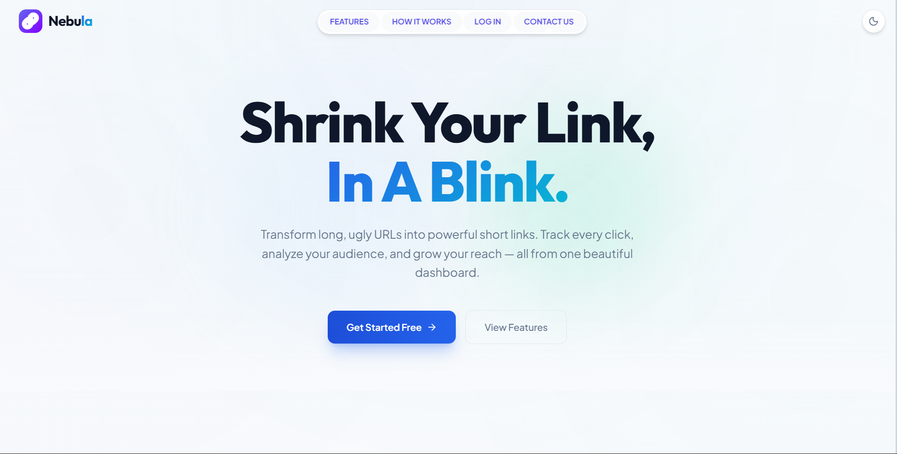

### 🔄 Landing Page — How It Works
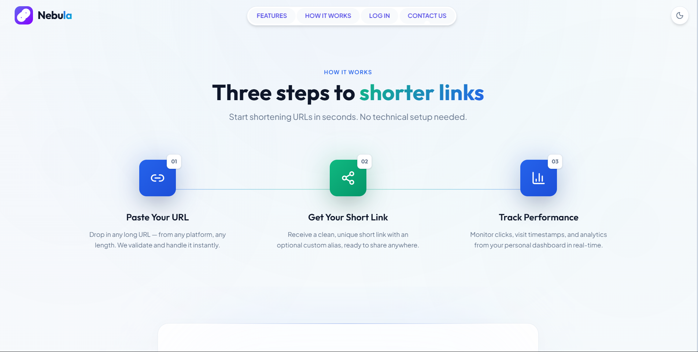

### 🔗 Dashboard — URL Shortener
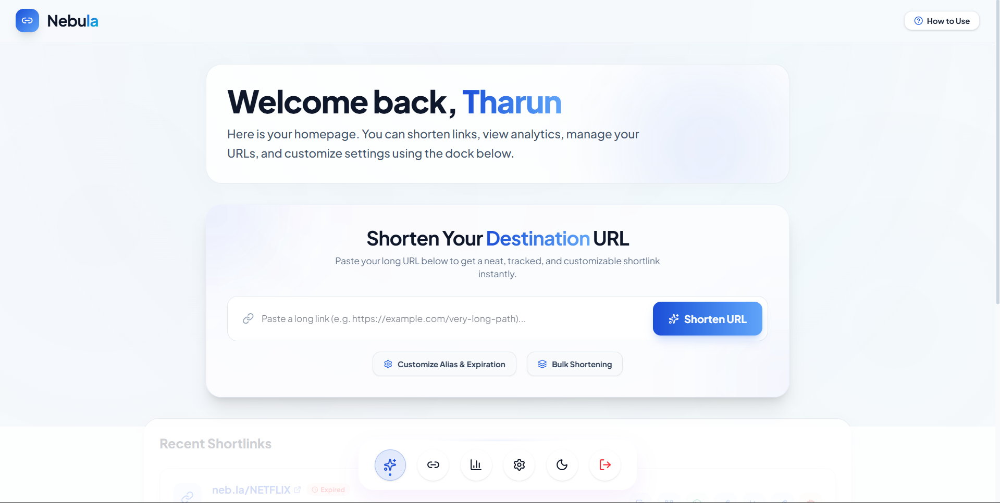

### 📊 Dashboard — Analytics
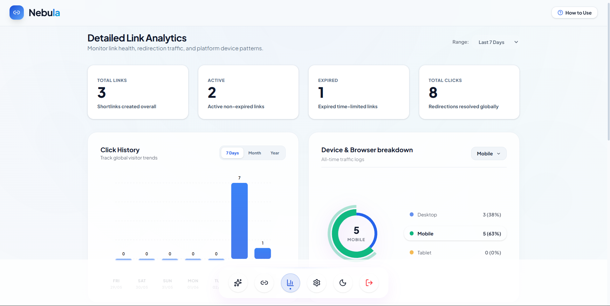

### 📈 Click History Trend Analysis
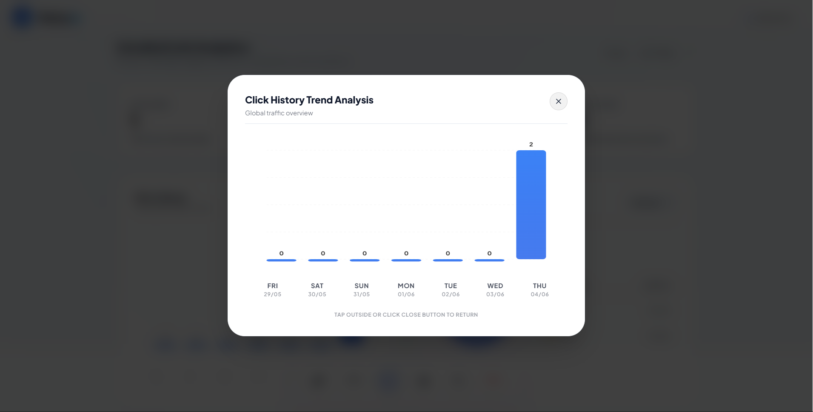

### 📱 Device & Browser Share
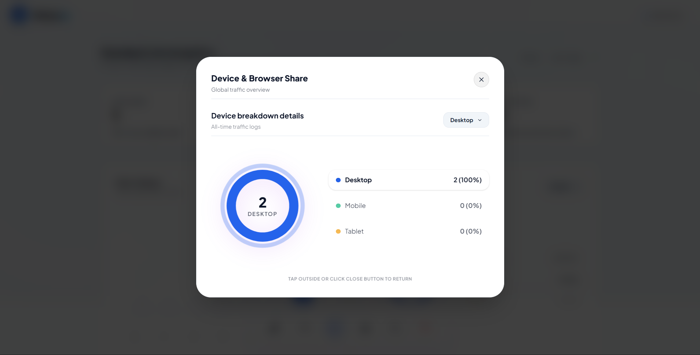

### 📷 QR Code Generation & Sharing
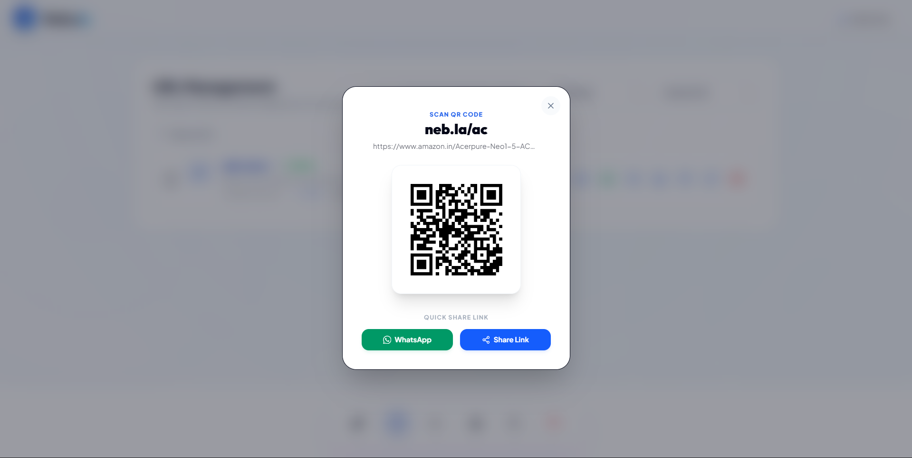

### 🌐 Public Stats Page
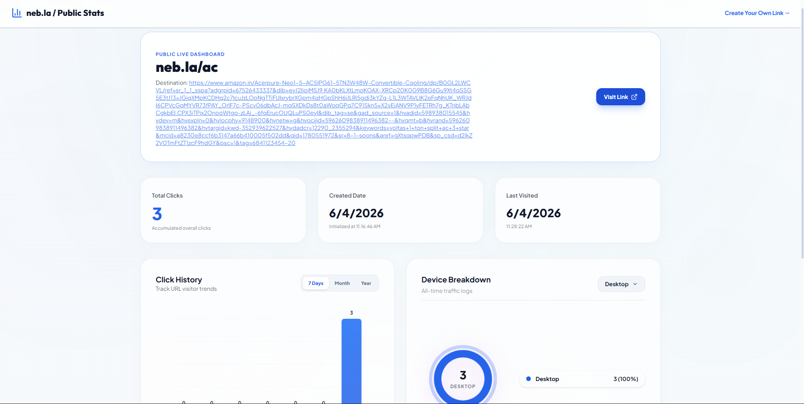

### ⚙️ Account Settings & Security
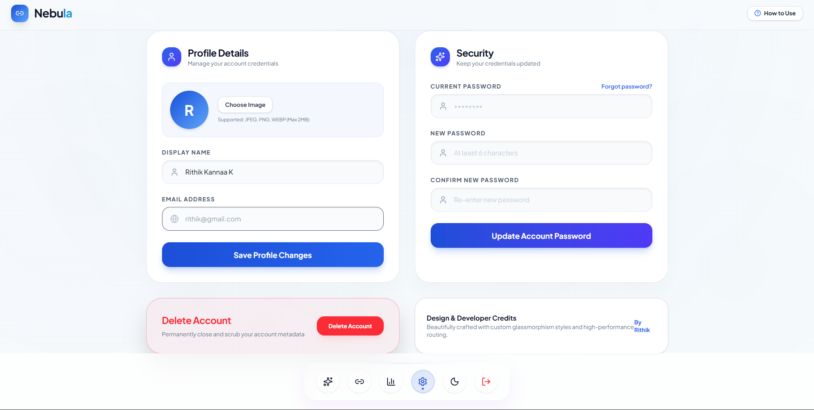

### 🔒 Link Suspended Page
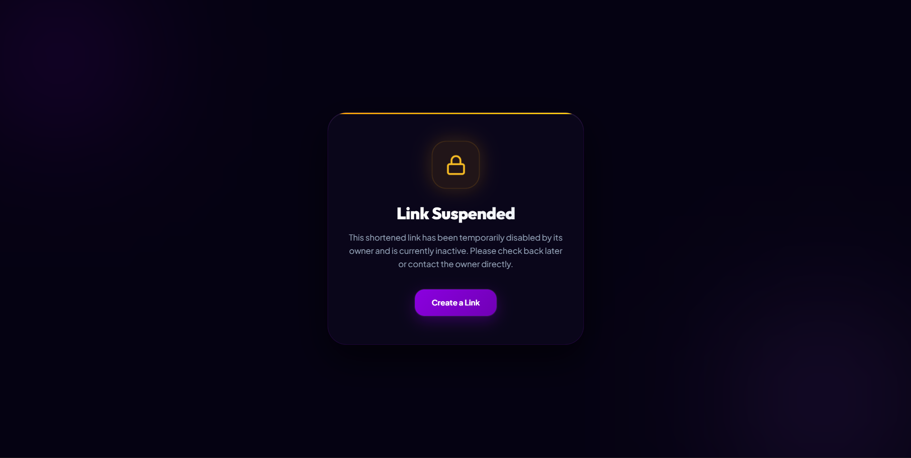

### ⏰ Link Expired Page
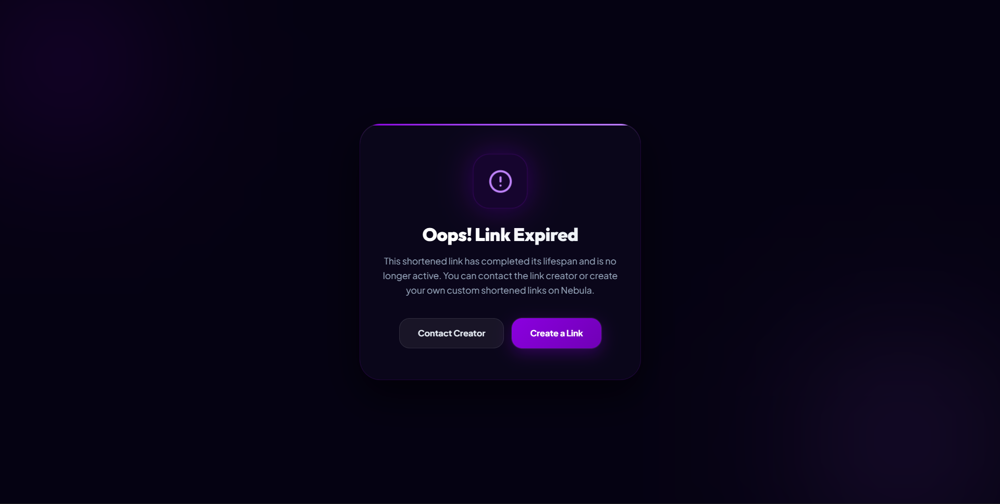

</div>

---

## 🗄️ Sample Database Entries

<div align="center">

### Users Collection
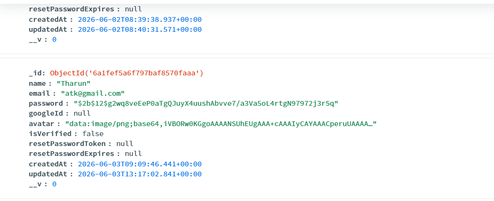

### URLs Collection
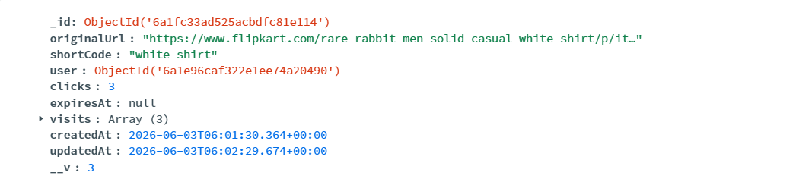

</div>

---

## 🧠 AI Planning Document

### Project Vision

Build a **production-ready URL shortener** that goes beyond basic link shortening to provide a complete link management and analytics platform with enterprise-grade security and a premium user experience.

### Development Phases

#### Phase 1: Foundation (Backend Core)
- [x] Express server setup with middleware stack (CORS, cookies, JSON parsing)
- [x] MongoDB Atlas connection with TLS compatibility for Node 22+
- [x] User model with bcrypt password hashing (12 salt rounds) and pre-save hooks
- [x] URL model with embedded visit sub-documents for analytics
- [x] JWT-based authentication with HTTP-only cookie strategy

#### Phase 2: API Development
- [x] Auth endpoints — signup, login, Google OAuth, logout, forgot/reset password
- [x] URL CRUD — create (with custom alias), read, update, delete, bulk delete
- [x] Short code redirect with visit tracking (browser, device, country)
- [x] Input validation via express-validator with descriptive error messages
- [x] Custom HTML error pages for 404, disabled, and expired links

#### Phase 3: Frontend Foundation
- [x] Vite + React 19 project scaffold with TailwindCSS 4
- [x] Global state management — AuthContext (user session) + ThemeContext (dark/light)
- [x] React Router v7 with protected routes and navigation guards
- [x] API configuration layer with environment-aware base URL

#### Phase 4: UI/UX — Landing & Auth
- [x] Premium landing page with hero, features grid, how-it-works, pricing, and CTA
- [x] Glassmorphism design system with frosted-glass cards and gradient accents
- [x] Animated auth page with login/signup toggle and Google OAuth button
- [x] Toast notifications for all user actions via react-hot-toast

#### Phase 5: Dashboard & Analytics
- [x] URL management dashboard with create, edit, copy, delete actions
- [x] Rich analytics dashboard with interactive charts and date range filtering
- [x] QR code generation for every shortened link
- [x] Public-facing stats page for link sharing
- [x] Account settings panel — profile editing, password change, theme toggle

#### Phase 6: Polish & Resilience
- [x] Offline detection overlay with reconnection monitoring
- [x] Responsive design across mobile, tablet, and desktop breakpoints
- [x] Micro-animations with Framer Motion and GSAP
- [x] SEO optimization — meta tags, semantic HTML, proper heading hierarchy
- [x] Error handling with styled HTML error pages served by the backend

### Design Decisions

| Decision | Rationale |
|----------|-----------|
| **HTTP-only cookies over localStorage** | Prevents XSS attacks from accessing JWT tokens |
| **Embedded visit sub-documents** | Avoids separate collection joins for fast analytics queries |
| **6-char hex short codes** | 16.7M unique combinations; collision-checked before saving |
| **Express 5** | Improved async error handling and routing |
| **React 19** | Latest concurrent features and improved performance |
| **TailwindCSS 4** | Faster builds, native CSS nesting, zero-config setup |

---

## 📋 Assumptions Made

1. **MongoDB Atlas** is used as the database provider. The connection string includes TLS compatibility patches for Node.js 22+ with OpenSSL 3.
2. **Users must be authenticated** to create, manage, or delete shortened URLs. There is no anonymous URL shortening.
3. **Short codes are 6-character hex strings** generated from `crypto.randomBytes(3)`, providing ~16.7 million unique combinations. Collision checking ensures uniqueness.
4. **Custom aliases** are optional and must be alphanumeric (with hyphens and underscores allowed). They are validated for uniqueness.
5. **JWT tokens expire after 7 days** and are stored in HTTP-only cookies to prevent XSS attacks. A `Bearer` header fallback is supported.
6. **Google OAuth** requires a valid Google Client ID configured in the environment. Google sign-in users do not have a password and cannot use the password login flow.
7. **Visit analytics** (browser, device, country) are parsed from the request `User-Agent` header server-side. Country detection is approximated and may require a dedicated IP geolocation service for production accuracy.
8. **Email functionality** (password reset) uses Nodemailer. In development, reset tokens are logged to the console instead of sent via email.
9. **The frontend and backend run on separate ports** during development (`5173` and `5000` respectively), with CORS configured to allow cross-origin requests.
10. **No rate limiting** is implemented in the current version. A production deployment should add rate limiting middleware (e.g., `express-rate-limit`).
11. **Link expiration** is checked at redirect time, not via a background cron job. Expired links remain in the database but return a styled "Link Expired" page.
12. **The application is designed for modern browsers** (Chrome 90+, Firefox 90+, Safari 15+, Edge 90+). Legacy browser support is not guaranteed.

---

## 🔒 Environment Variables Reference

### Backend (`Backend/.env`)

| Variable | Required | Default | Description |
|----------|----------|---------|-------------|
| `PORT` | No | `5000` | Server port |
| `NODE_ENV` | No | `development` | Environment mode |
| `MONGO_URI` | **Yes** | — | MongoDB Atlas connection string |
| `JWT_SECRET` | **Yes** | — | Secret key for JWT signing |
| `JWT_EXPIRES_IN` | No | `7d` | Token expiration duration |
| `FRONTEND_URL` | No | — | Frontend URL for CORS |
| `CLIENT_URL` | No | — | Alternative frontend URL for CORS |

### Frontend (`Frontend/.env`)

| Variable | Required | Default | Description |
|----------|----------|---------|-------------|
| `VITE_API_BASE_URL` | No | `http://localhost:5000` | Backend API base URL |

---

## 🧪 Health Check

Verify the backend is running:

```bash
curl http://localhost:5000/api/health
```

Expected response:

```json
{
  "status": "OK",
  "message": "Nebula API is running"
}
```

---

## 📜 License

This project is open source and available under the [MIT License](LICENSE).

---

<div align="center">

### 🤝 Acknowledgements

This project is a part of a hackathon run by [https://katomaran.com](https://katomaran.com)

</div>

